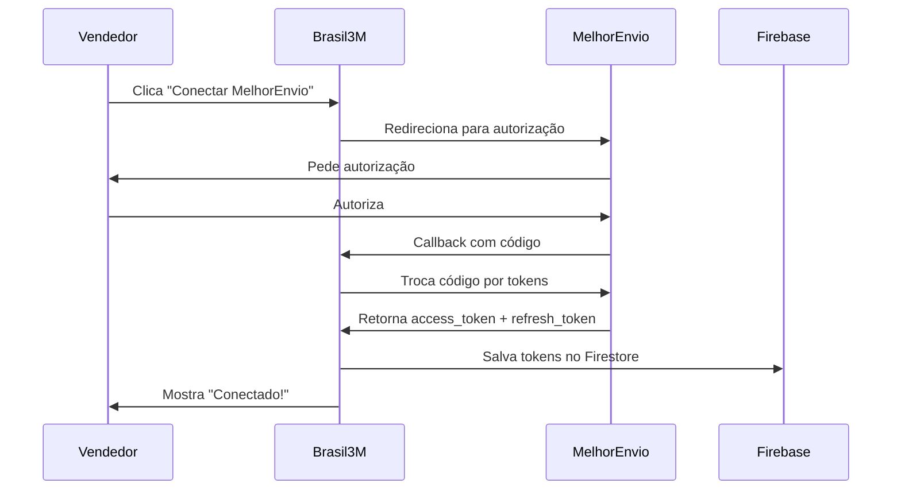

# MelhorEnvio OAuth2 Integration

Este documento explica como implementar e configurar a integração OAuth2 com o MelhorEnvio para permitir que múltiplos vendedores conectem suas contas individuais.

## 📋 Resumo da Implementação

### 1. **Situação Atual vs. Nova Implementação**

**Antes (Token Fixo):**
- Um token único no `.env`
- Usado para todos os vendedores
- Token gerado manualmente no painel

**Agora (OAuth2):**
- Cada vendedor tem seu próprio token
- Tokens obtidos via fluxo de autorização
- Renovação automática de tokens
- Segurança aprimorada

### 2. **Arquivos Criados/Modificados**

#### **Novos Arquivos:**
- `src/services/melhorEnvioAuth.ts` - Serviço OAuth2
- `src/pages/MelhorEnvioCallback.tsx` - Página de callback
- `src/components/MelhorEnvioConnection.tsx` - Componente de conexão
- `MELHOR_ENVIO_OAUTH2.md` - Este arquivo de documentação

#### **Arquivos Modificados:**
- `.env` - Adicionadas variáveis OAuth2
- `src/services/shippingService.ts` - Suporte a tokens por usuário
- `src/pages/Seller.tsx` - Adicionado componente de conexão
- `src/App.tsx` - Adicionada rota de callback

### 3. **Novas Variáveis de Ambiente**

```properties
# OAuth2 Configuration for MelhorEnvio
VITE_MELHOR_ENVIO_CLIENT_ID=your_client_id_here
VITE_MELHOR_ENVIO_CLIENT_SECRET=your_client_secret_here
VITE_MELHOR_ENVIO_REDIRECT_URI=http://localhost:5173/auth/melhor-envio/callback

# Token temporário para desenvolvimento (será substituído pelo OAuth2)
VITE_MELHOR_ENVIO_TOKEN=seu_token_atual...
```

## 🚀 Como Configurar

### 1. **Obter Client ID e Client Secret**

1. Acesse o [painel do MelhorEnvio](https://sandbox.melhorenvio.com.br)
2. Vá em **Configurações > Aplicações**
3. Clique em **"Criar Aplicação"**
4. Preencha os dados:
   - **Nome:** Brasil 3M
   - **Descrição:** Marketplace Brasil 3M
   - **URL de Callback:** `http://localhost:5173/auth/melhor-envio/callback`
   - **Ambiente:** Sandbox (para testes)
5. Copie o `client_id` e `client_secret`

### 2. **Atualizar .env**

```properties
VITE_MELHOR_ENVIO_CLIENT_ID=seu_client_id_aqui
VITE_MELHOR_ENVIO_CLIENT_SECRET=seu_client_secret_aqui
VITE_MELHOR_ENVIO_REDIRECT_URI=http://localhost:5173/auth/melhor-envio/callback
```

### 3. **Para Produção**

```properties
VITE_MELHOR_ENVIO_CLIENT_ID=production_client_id
VITE_MELHOR_ENVIO_CLIENT_SECRET=production_client_secret
VITE_MELHOR_ENVIO_REDIRECT_URI=https://seudominio.com/auth/melhor-envio/callback
VITE_MELHOR_ENVIO_SANDBOX=false
VITE_MELHOR_ENVIO_BASE_URL=https://api.melhorenvio.com.br
```

## 🔄 Como Funciona

### 1. **Fluxo de Autorização**



### 2. **Uso dos Tokens**

```typescript
// Exemplo de uso no cálculo de frete
const quotes = await calculateShipping(
  originCep,
  destinationCep,
  weight,
  dimensions,
  userId // ← Novo parâmetro para OAuth2
);
```

### 3. **Estrutura no Firestore**

```json
{
  "users": {
    "userId123": {
      "email": "vendedor@exemplo.com",
      "melhorEnvioTokens": {
        "access_token": "eyJ...",
        "refresh_token": "def...",
        "expires_in": 2592000,
        "expires_at": 1759415064033,
        "token_type": "Bearer",
        "scope": "shipping-calculate shipping-generate..."
      },
      "melhorEnvioConnected": true,
      "melhorEnvioConnectedAt": "2025-01-02T10:30:00Z"
    }
  }
}
```

## 🛠️ API Reference

### **MelhorEnvioAuth Class**

```typescript
// Gerar URL de autorização
const authUrl = MelhorEnvioAuth.getAuthorizationUrl(userId);

// Trocar código por tokens
const tokens = await MelhorEnvioAuth.exchangeCodeForTokens(code, userId);

// Obter token válido (renova se necessário)
const token = await MelhorEnvioAuth.getValidAccessToken(userId);

// Verificar se usuário está conectado
const isConnected = await MelhorEnvioAuth.isUserConnected(userId);

// Desconectar usuário
await MelhorEnvioAuth.disconnectUser(userId);
```

### **ShippingService Atualizado**

```typescript
// Agora aceita userId opcional
const quotes = await calculateShipping(
  originCep,
  destinationCep,
  weight,
  dimensions,
  userId // ← Novo parâmetro
);

// Verificar se vendedor está conectado
const isConnected = await isSellerConnected(userId);
```

## 🎯 Benefícios da Implementação

### **Para os Vendedores:**
- ✅ Cada vendedor usa sua própria conta MelhorEnvio
- ✅ Fretes calculados com suas configurações específicas
- ✅ Gestão independente de envios
- ✅ Controle total sobre autorização

### **Para a Plataforma:**
- ✅ Segurança aprimorada (sem tokens fixos)
- ✅ Conformidade com OAuth2
- ✅ Renovação automática de tokens
- ✅ Escalabilidade para múltiplos vendedores

### **Para os Compradores:**
- ✅ Fretes mais precisos
- ✅ Múltiplas opções de transportadoras
- ✅ Rastreamento detalhado

## 🔧 Troubleshooting

### **Problema: Token expirado**
**Solução:** O sistema renova automaticamente usando `refresh_token`

### **Problema: Vendedor não conectado**
**Solução:** O sistema usa fallback com valores simulados

### **Problema: CORS em produção**
**Solução:** Configurar proxy no servidor ou usar backend

### **Problema: Callback não funciona**
**Solução:** Verificar se a URL de callback está registrada corretamente no MelhorEnvio

## 📦 Próximos Passos

1. ✅ **Implementação OAuth2** - Concluído
2. ⏳ **Testes com vendedores reais**
3. ⏳ **Implementar geração de etiquetas**
4. ⏳ **Adicionar webhook para atualizações de status**
5. ⏳ **Dashboard de métricas de envio**

## 📞 Suporte

Para dúvidas sobre a integração:
- 📧 Email: suporte@brasil3m.com
- 📖 Documentação MelhorEnvio: https://docs.melhorenvio.com.br
- 🔧 Issues do projeto: GitHub Issues

---

**✨ A implementação OAuth2 está pronta! Agora cada vendedor pode conectar sua própria conta MelhorEnvio de forma segura e independente.**
